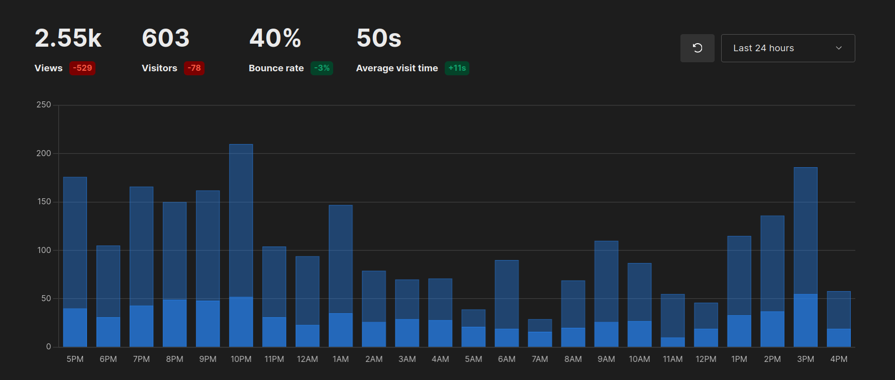

Notice: This blog post was originally created by Eric Murphy, and is therefore not my own, but I have decided to include it because I like it. This blog post does include many talking points personal to Eric, and I've also never used analytics on this site, but his reasons align with mine on this matter. 

This website is **analytics-free**!

If you know me, I'm sure you understand [why I don't use Google Analytics](https://www.youtube.com/watch?v=NJmtkh-3LBw). But there are lots of other good, privacy-respecting analytics services and softwares out there. I've even done [several](https://www.youtube.com/watch?v=9x8w9igz7Ew) [videos](https://www.youtube.com/watch?v=qKSqTPY-qV8) about privacy-respecting web analytics. They're very good, and I still recommend them to this day. I've also used these services in the past on my website.

However, **I've still chosen to not use analytics at all for this website.**

## Why not?

This may seem somewhat hypocritical, as I use a service that collects **a metric-ton of analytics**. It's called [YouTube](https://youtube.com/@ericmurphyxyz/).

But analytics for a website makes less sense. If one of my blog posts "goes viral", it doesn't really impact my life at all. What if I were to see that a blog post went viral on Reddit and got 10 times the traffic that I normally do?

Well, it would be exciting, but that's about it. It doesn't really translate to me making more money or my life materially getting better at all.

But if it did really help someone, they might send me an email telling me how it helped them, or changed their mind about something. To me, a single email like that is much more impactful than thousands of "views".

## They don't even work

Not to mention that web analytics aren't even accurate. [Especially with a more technical audience](https://plausible.io/blog/google-analytics-adblockers-missing-data), like I have, a good portion of people visiting my website are probably using some form of an ad or tracker blocker. This also blocks analytics, which leads to very skewed results. When using Google Analytics, it's very common that your numbers will be vastly off from the actual number of visitors.

Even with a self-hosted or privacy-respecting option, it usually involves loading in a small JavaScript file that most blockers are smart enough to block. Back when I used analytics for my site, every browser that I used blocked my own script. [Firefox](https://www.youtube.com/watch?v=Fr8UFJzpNls) with uBlock Origin blocked it, as did [Brave](https://www.youtube.com/watch?v=uB845Elrds0). So I'm still getting the same, skewed results that I would get with Google Analytics.

*I* didn't even want to get my own analytics script. That's why I had my browser configured to block scripts like it. So why was I pushing something to my visitors that not even I would accept?

## Other reasons

I like my website to be fast, like the old days of the internet, which were ironically faster than the internet these days. Google Analytics is notoriously bloated, but even simpler analytics services can still bring in a lot of unnecessary JavaScript. Without analytics, my site is just that much more performant. Does a few kilobytes of JavaScript *really* make a big difference? Probably not, but I like the feeling of optimizing my website as much as possible.

Plus, with no tracking, you never have to include any stupid GDPR or cookie consent pop-ups. Isn't everyone tired of clicking on the annoying cookie banners on every website?

If you still want some kind of analytics, you can check your server logs. I've played around with a tool called [GoAccess](https://goaccess.io/) in the past that gives you a report similar to a lot of analytics services. Best of all, there's no performance loss because you're not loading in any additional scripts.

## I'm not against analytics

Now, I'm really not against the concept of analytics where they are necessary. If, for example, you're running an ad campaign for your website, you most definitely do want to see if your money is being well-spent or not. A lot of people in the "web minimalism" space are very all-or-nothing, where your site must contain zero JavaScript and look like it's still the 90's, or else it's **bloated**. Of course, I don't think you need to go to such extremes, but I very much think that JavaScript should only be used if it's really necessary. A lot of times analytics just are not needed, and the common wisdom that you need to install Google Analytics *on every new website you make* just doesn't make sense.